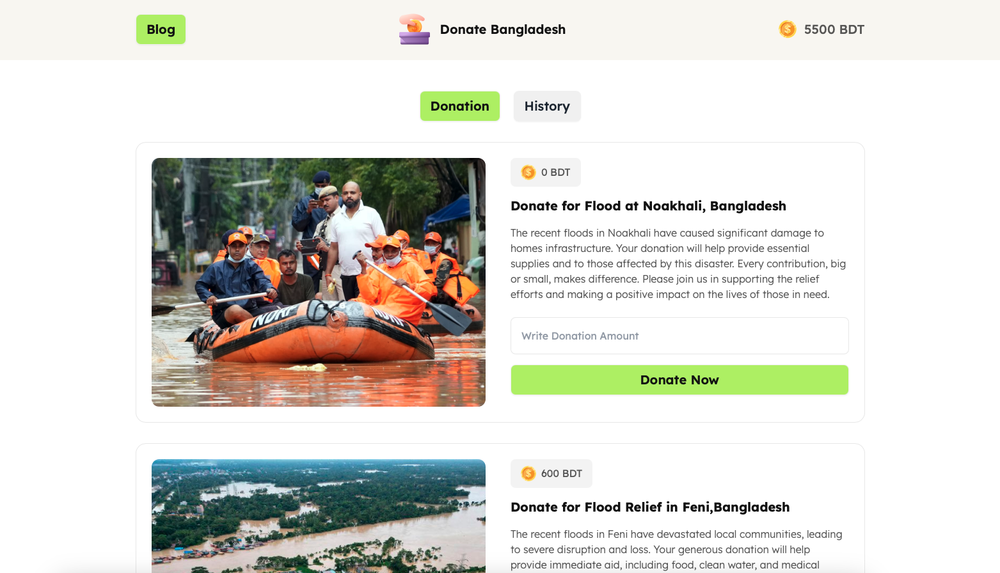

# Donate Bangladesh

## Description

**Donate Bangladesh** is a web-based donation platform designed to support relief efforts in Bangladesh. Users can contribute to different causes, including flood relief and medical aid for injured individuals.

- **Live Project:** [https://rakibcodes36.github.io/assignment-05/]
- **Technologies Used:** HTML, CSS (Tailwind CSS, DaisyUI), JavaScript

## Screenshot

 

## Features

- User-friendly donation interface
- Real-time balance updates
- Different donation categories (Flood Relief, Medical Aid, etc.)
- Responsive design for seamless experience across devices

## Technologies Used

- **Frontend:** HTML, Tailwind CSS, DaisyUI
- **JavaScript:** Interactive functionalities
- **External Libraries:** Tailwind CSS CDN, DaisyUI CDN

## Dependencies

- [Tailwind CSS](https://cdn.tailwindcss.com)
- [DaisyUI](https://daisyui.com)

## How to Run Locally

1. Clone the repository:
   ```sh
   git clone https://github.com/yourusername/donate-bangladesh.git
   ```
2. Navigate to the project folder:
   ```sh
   cd donate-bangladesh
   ```
3. Open `index.html` in your browser.

## Live Project & Resources

- **Live Project:** [https://rakibcodes36.github.io/assignment-05/]
- **GitHub Repository:** [https://github.com/rakibCodes36/assignment-05]

